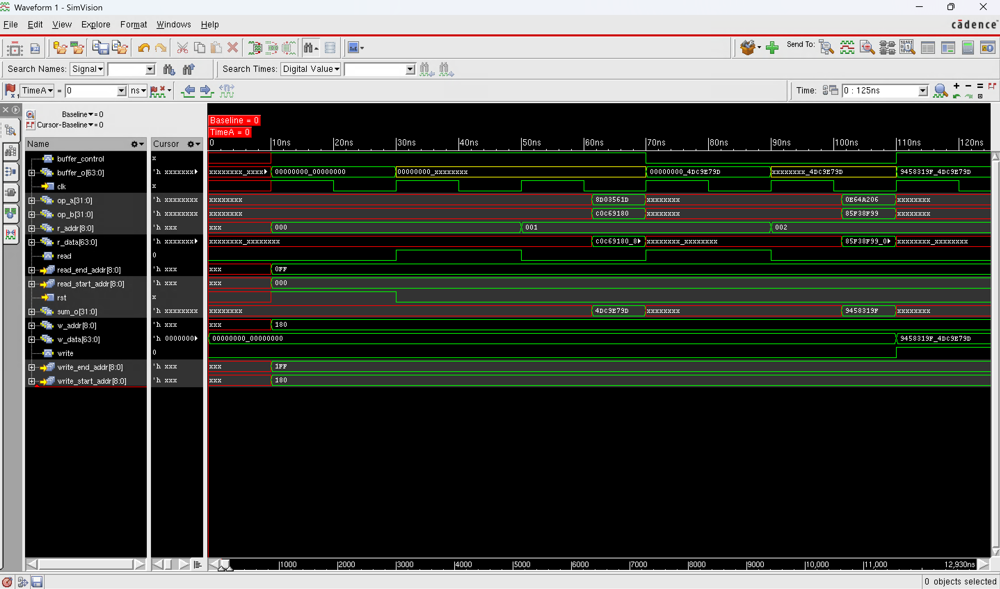
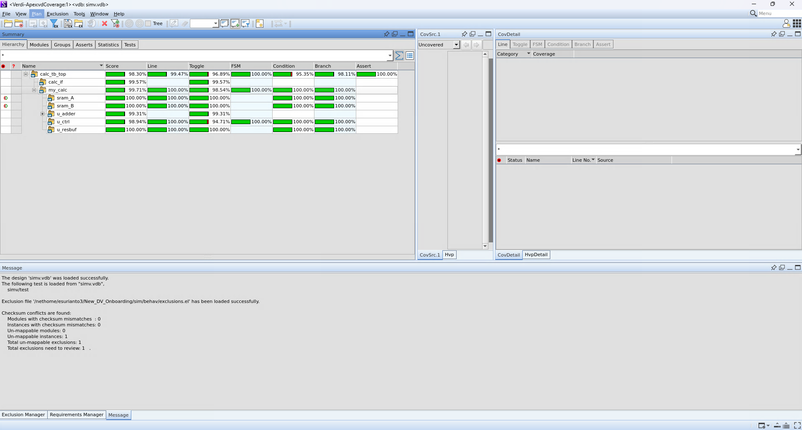

# 64bit-Calculator-FSM
Design and Verification (UVM) of 64-bit unsigned integer calculator in SystemVerilog.

The core of the design is a Finite State Machine (FSM) controller that uses a single 32-bit adder module twice. The FSM reads two pairs of 32-bit operands from SRAM, directs the adder to compute two separate sums, assembles the results into the lower and upper halves of a 64-bit buffer, and writes the final sum back to memory.c

**Objective:** Design a calculator that performs 64-bit unsigned addition by orchestrating two 32-bit additions using a Finite State Machine (FSM).  
---

### **Modules Implemented**

* **adder32.sv**  
  * **Function:** Computes the sum of two 32-bit unsigned integers.  
  * **Requirement:** Must be built using a generate for loop to create 32 1-bit full adders.  
* **result\_buffer.sv**  
  * **Function:** Stores the final 64-bit result.  
  * **Requirement:** Accepts a 32-bit input and uses a select signal to place it in either the upper or lower half of the 64-bit register. Must have a synchronous reset.  
* **controller.sv**  
  * **Function:** Manages the entire operation sequence using an FSM.  
  * **Requirement:** Coordinates reads from SRAM, controls the adder and buffer, and initiates writes back to SRAM.  
* **top\_lvl.sv**  
  * **Function:** Serves as the top-level design.  
  * **Requirement:** Instantiates and connects all other modules (SRAM, controller, adder, buffer).

---

### **FSM Controller Logic Flow**

The state machine will sequence through the following core operations:

1. **IDLE**: Wait for the system to exit reset.  
2. **READ\_LOWER**: Read the first pair of 32-bit operands from SRAM.  
3. **ADD\_LOWER**: Compute the sum and store it in the **lower** half of the result buffer.  
4. **READ\_UPPER**: Read the second pair of 32-bit operands from the next address.  
5. **ADD\_UPPER**: Compute the sum and store it in the **upper** half of the result buffer.  
6. **WRITE**: Write the complete 64-bit result from the buffer back to SRAM.  
7. **END**: Check if the operation is complete; if not, loop back to the **READ\_LOWER** state.

---

### **Verification & Simulation Steps**

To test the design, navigate to the sim/ directory and run the following commands:

1. **make link**: Links the source files into the simulation directory.  
2. **make xrun** or **make verify\_onboarding**: Compiles and runs the simulation testbench.  
3. **make simvision**: Opens the waveform viewer to debug and analyze the results.

---

### **Design Final Result**

This waveform demonstrates a complete and successful 64-bit addition cycle, confirming the calculator is working correctly. The FSM controller properly sequences through its states to read two 32-bit operand pairs from memory (r_data). Each sum is calculated and correctly placed into the lower and then upper halves of the result buffer (buffer_o). Finally, the controller asserts the write signal to store the final 64-bit sum (w_data) back into memory.

## **Advanced Testbench Verification for a Calculator DUT**

**Objective:** To learn a standard verification workflow (UVM) by developing a comprehensive testbench for a pre-existing calculator design (DUT). The project focuses on creating a robust test plan, implementing testbench components, writing assertions, using constrained randomization, and achieving high functional coverage.   
---

### **Testbench Components Implemented**

* **calc\_seq\_item.svh**: Defines the transaction object containing the data and constraints for randomized testing.  
* **calc\_driver.svh**: Drives the DUT by converting transactions (sequence items) into pin-level signal activity.  
* **calc\_monitor.svh**: Observes DUT pin activity and reconstructs it back into transactions for analysis.  
* **calc\_sb.svh**: The scoreboard, which verifies DUT correctness by comparing transactions from the monitor against a golden reference model.  
* **calc\_tb\_top.sv**: The top-level testbench file responsible for instantiating the DUT and all verification components.

---

### **Verification Strategy & Task Flow**

This project follows a structured approach to ensure the DUT is thoroughly tested.

1. **Develop a Test Plan**: Create a detailed plan that outlines tests for various scenarios:  
   * **Functional Testing**: Verify basic operations like addition (with/without overflow) and memory access.  
   * **Boundary Testing**: Test edge cases such as adding zero or maximum values (0+0, MAX+MAX).  
   * **Assertion-Based Checks**: Define specific properties to monitor internal DUT behavior.  
2. **Implement Testbench Components**: Write the SystemVerilog code for the driver, monitor, and scoreboard to execute and check the tests defined in your plan.  
3. **Add SystemVerilog Assertions (SVA)**: Integrate concurrent assertions into the testbench to automatically check for correct behavior, such as:  
   * Proper reset functionality.  
   * Correct processing order (LSBs before MSBs).  
   * Valid memory address ranges.  
4. **Implement Constrained Randomization**: Add constraints to the calc\_seq\_item class to generate a wide variety of valid, random test stimuli to uncover unexpected bugs.  
5. **Achieve Coverage Goals**: Iteratively run tests and analyze the results to ensure your testbench adequately exercises the DUT's code, aiming to reach at least **96% functional coverage**.

---

### **Simulation & Analysis Workflow**

Use the following commands from the sim/behav/ directory to manage the verification process:

* **make xrun**: Compiles the DUT and testbench and runs the simulation using Cadence Xcelium.  
* **make verisium**: Launches the Cadence Verisium Debug tool to view waveforms and debug test failures.  
* **make vcs** then **make coverage**: Runs the simulation with Synopsys VCS to generate a coverage database, then opens the report in Verdi to analyze the results.

---

### **Final Results**

Reached over 99% coverage for my_calc DUT, with 100% for FSM

